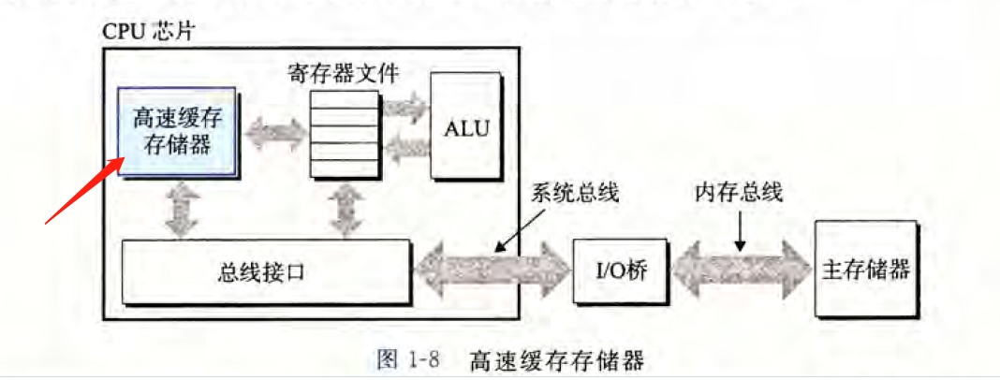
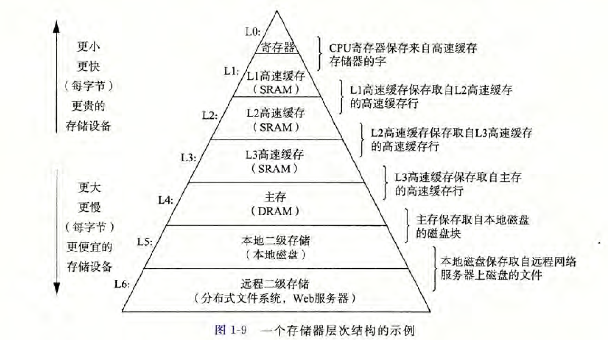

# 计算机系统漫游

计算机系统 = 硬件 + 软件系统

```c
#include <stdio.h>

int main(void)
{
    printf("hello world\n");

    return 0;
}
```

## 信息就是位 + 上下文

系统中的所有信息--包括磁盘文件、内存中的程序、网络上传输的数据，都是由一串比特表示的

区分不同数据的唯一方法是时读到这些数据时的上下文。（int float ...）
一个同样的字节序列可能代表不同的意义

应该了解数字的机器表示方式

## 程序被其他程序翻译成不同格式

c语句 --> 机器语言指令 --> 按照可执行目标程序格式打包并以二进制磁盘文件的形式存放 -->   可执行目标文件

在 Unix 系统上 ，从源文件到目标文件的转化是由编译器驱动程序完成的
```bash
gcc -o hello.c
```

这个翻译过程分为四个阶段


执行这四个阶段的程序（预处理器，编译器，汇编器，连接器）构成了编译系统

+ 预处理阶段： 处理 ‘#’
+ 编译阶段： 转汇编
+ 汇编阶段： 转机器语言
+ 链接阶段： 整合其它文件

## 了解编译器如何工作是大有益处的

益处：

+ 优化程序性能
+ 理解链接时出现的错误
+ 避免安全漏洞

## 处理器读并解释存在内存中的指令

可以执行那个可执行文件
```bash
./hello.o
```

### 系统的硬件组成


**1、总线**

总线是一组电子管道，负责携带、传递信息字节。它通常被设计成传递定长的字节块，也就是字（word）。字中的字节数（字长）是一个基本的系统参数，大多为4个字节（32位）或者8个字节（64位）。

**2、I/O设备**

输入输出设备（键盘 磁盘 显示器 ...）
每个I/O 设备都通过一个控制器或适配器与I/O总线相连。

控制器是I/O设备本身或者系统的主印制电路板（主板）上的芯片组

适配器是一块在主板插槽上的卡

它们的功能都是在I/O总线和I/O设备之间传递信息

**3、主存**

主存是一个临时存储设备，在处理器执行程序时，用来存放程序和程序处理的数据。

从物理上说，主存是由一组动态随机存取存储器(DRAM)芯片组成的。

从逻辑上说，存储器是一个线性的字节数组，每个字节都有其唯一的地址（数组索引），这些地址是从零开始的。

**4、处理器**

中央处理单元（CPU）,简称处理器，是解释（或执行）存储在主存中指令的引擎。

处理器的核心是一个大小为一个字的存储设备（寄存器），称为程序计数器(PC)。在任何时刻，PC都指向主存中的某条机器语言指令（即含有该条指令的地址 ）。

从系统通电开始，直到系统断电，处理器一直在不断地执行程序计数器指向的指令， 再更新程序计数器，使其指向下一条指令。处理器看上去是按照一个非常简单的指令执行 模型来操作的，这个模型是由指令集架构决定的。在这个模型中，指令按照严格的顺序执 行，而执行一条指令包含执行一系列的步骤。处理器从程序计数器指向的内存处读取指令，解释指令中的位，执行该指令指示的简单操作，然后更新PC,使其指向下一条指令， 而这条指令并不一定和在内存中刚刚执行的指令相邻。

这样的简单操作并不多，它们围绕着主存、寄存器文件(register file)和算未/逻辑单 元(ALU)进行。寄存器文件是一个小的存储设备，由一些单个字长的寄存器组成，每个 寄存器都有唯一的名字。ALU计算新的数据和地址值。下面是一些简单操作的例子, CPU在指令的要求下可能会执行这些操作。

处理器看上去是它的指令集架构的简单实现，但是实际上现代处理器使用了非常复杂 的机制来加速程序的执行。因此，我们将处理器的指令集架构和处理器的微体系结构区分 开来：指令集架构描述的是每条机器代码指令的效果；而微体系结构描述的是处理器实际 上是如何实现的。

### 运行hello程序

1、shell接收指令，加载可执行文件，将其从磁盘复制到主存（DMA技术）

2、处理器开始执行程序中的机器指令，将‘hello，world\n'字节从主存复制到寄存器文件，再从寄存器文件复制到显示设备，完成显示


## 高速缓存至关重要

系统花费大量时间把信息从一个地方挪到另一个地方。

大小：磁盘 > 主存 > 寄存器

速度：寄存器 > 主存 > 磁盘


针对这种处理器与主存之间的差异，系统设计者采用了更小更快的存储设备，称为高 速缓存存储器（cache memory,简称为cache或高速缓存），作为暂时的集结区域，存放处 理器近期可能会需要的信息。


L1:位于处理 器芯片上的L1高速缓存的容量可以达到数万字节，访问速度几乎和访问寄存器文件一样 快。

L2:一个容量为数十万到数百万字节的更大的L2高速缓存通过一条特殊的总线连接到处 理器。进程访问L2高速缓存的时间要比访问L1高速缓存的时间长5倍，但是这仍然比访 问主存的时间快5〜10倍。

L1和L2高速缓存是用一种叫做静态随机访问存储器(SRAM) 的硬件技术实现的。比较新的、处理能力更强大的系统甚至有三级高速缓存：LI、L2和 L3。系统可以获得一个很大的存储器，同时访问速度也很快，原因是利用了高速缓存的局 部性原理，即程序具有访问局部区域里的数据和代码的趋势。通过让高速缓存里存放可能 经常访问的数据，大部分的内存操作都能在快速的高速缓存中完成。

意识到高速缓存存储器存在的应用程序员能够利用高速缓 存将程序的性能提高一个数量级。

## 存储设备形成层次结构

每个计算机系统中的存储设备都被组织成了一个存储器层次结构

存储器层次结构的主要思想是上一层的存储器作为低一层存储器的高速缓存。因此， 寄存器文件就是L1的高速缓存，L1是L2的高速缓存，L2是L3的高速缓存，L3是主存 的高速缓存，而主存又是磁盘的高速缓存。在某些具有分布式文件系统的网络系统中，本 地磁盘就是存储在其他系统中磁盘上的数据的高速缓存。

## 操作系统管理硬件

所有应用程序对硬件的操作尝试都必须通过操作系统

操作系统有两个基本功能：

+ 防止硬件被失控的应用程序滥用
+ 向应用程序提供简单一致的机制来控制复杂而又通常大不相同的低级硬件设备

文件是对I/O设备的抽象表示，内存是对主存和磁盘I/O设备的抽象表示 ，进程则是对处理器、主存和I/O设备的抽象表示。

### 进程ss

进程是操作系统对一个正在运行的程序的一种抽象。在一个系统上可以同时运行多个 进程，而每个进程都好像在独占地使用硬件。而并发运行，则是说一个进程的指令和另一 个进程的指令是交错执行的。在大多数系统中，需要运行的进程数是多于可以运行它们的 CPU个数的，传统系统在一个时刻只能执行一个程序，而先进的多核处理器同时能够执 行多个程序。无论是在单核还是多核系统中，一个CPU看上去都像是在并发地执行多个 进程，这是通过处理器在进程间切换来实现的。操作系统实现这种交错执行的机制称为上 下文切换。

